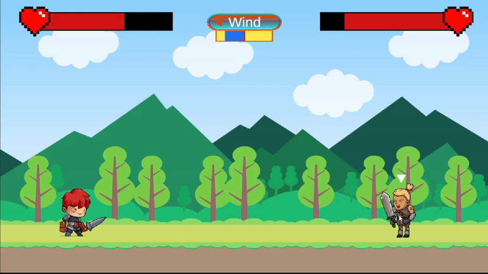

# 🥊 FightClub – Unity 2D Physics-Based Fighting Game

FightClub is a **2D turn-based physics fighting game** developed in Unity.

This project was created **entirely from my own idea and implementation**, **without using any AI tools** and **without following any tutorial or training video**.  
All gameplay logic, systems, and flow were built **from scratch** through trial and error.

The game is inspired by the classic childhood game **“Kedi Köpek Savaşı”** and focuses on **throw mechanics**, **wind-based strategy**, and **UI-driven game flow**.

---

## 🎥 Gameplay Previews

### 🗺️ Map Selection & Game Start
_Player selects one of four maps and starts the match_

---

### 🎯 Throw Mechanic, Power Bar & Wind Effect
_Press & hold to charge, release to throw — wind affects every shot_

---

### 🏁 Win Screen, Restart & Main Menu Flow
_Winning the match, restarting the game, or returning to main menu_

---

## 🧭 Project Overview

- **Genre:** 2D turn-based physics fighting  
- **Core mechanic:** press & hold → release to throw  
- **Key system:** dynamic wind (direction + strength)  
- **Maps:** 4 selectable maps  
- **Scene structure:** entire game runs in **a single Unity scene**  
- **Assets:** visuals, animations, UI elements, and sound effects from **Unity Asset Store**  
- **All gameplay systems & logic:** implemented entirely by me  

---

## 🎮 Scene Architecture (Single Scene System)

Although the game behaves like it has multiple screens, everything is handled inside **one Unity scene**.

### 🏠 Main Menu
- Map selection (4 different maps)
- Start button to begin the match

### 🎮 Gameplay
- Two characters face each other
- Characters remain stationary
- Players throw objects turn-by-turn
- Wind changes before each throw

### 🔁 End Game Flow
- **Restart Game**: restarts the match instantly
- **Main Menu**: returns to map selection

All transitions are controlled via **UI and game state logic**, without scene switching.

---

## 🧠 Gameplay Logic Overview

- Player presses and holds on their character to charge throw power
- A **power bar** appears while holding
- Releasing launches a throwable object
- The **wind indicator** at the top of the screen changes every turn:
  - Wind direction
  - Wind strength
- Players must adjust each throw based on:
  - power bar level
  - wind direction
  - wind strength
- If the thrown object hits the opponent:
  - opponent health decreases
- The first character to reduce the opponent’s health to zero **wins the game**

---

## ⌨️ Controls

| Platform | Input | Action |
|--------|-------|--------|
| Desktop | Mouse Hold + Release | Charge & Throw |
| Mobile (optional) | Touch Hold + Release | Charge & Throw |
| UI | Start Button | Start Match |
| UI | Restart Button | Restart Match |
| UI | Main Menu Button | Return to Main Menu |

---

## 🧩 Assets & External Resources

To focus on gameplay systems rather than asset creation, the following were used:

- **Unity Asset Store** assets for:
  - Character visuals
  - Animations
  - UI elements
  - Sound effects

All **gameplay logic, mechanics, wind system, damage system, UI flow, and state management** were implemented entirely by me.

---

## 🧪 Key Learnings & Self-Reflection

This project was built **without planning and without external guidance**, which led to valuable realizations:

- Code readability could be improved
- Variable naming could be clearer
- Better grouping and categorization of variables
- More comments would improve maintainability

This experience taught me **why clean code and planning matter**, not just how to make systems work.

---

## 🛠️ Tools & Technologies

- **Unity 2022.x (2D)**
- **C# with Visual Studio**
- Unity 2D Physics (Rigidbody2D, Colliders)
- Unity UI (Canvas, Buttons, Sliders)
- Prefab-based workflow

---

## ▶️ How to Run the Project

1. Clone or download this repository  
2. Open **Unity Hub**  
3. Click **Open Project**  
4. Select the project folder  
5. Press **Play**  

---

## 👤 Author

**Eren Yusuf Can**  
Software Engineering Student  
Unity Game Developer (Junior)
